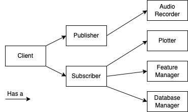

# SWAN : Simple Wireless Acoustic (Sensor) Network client for Python

## Introduction

Wireless Acoustic Sensor Networks (WASNs) consist of multiple devices which share their microphone recordings using a wireless channel such as WiFi.
Such devices may be notebooks, cell phones, voice assistants, hearing aids, etc. 

The goal of transmitting acoustic information over a network is to create network-connected microphone arrays, which allows for tasks such as source localization and beamforming to be performed. 

The goal of this project is to provide a simple way for devices to share their microphone recordings over wireless networks. This is achieved using the Message Queue Telemetry Transport (MQTT) protocol, an established protocol for Internet-of-Things (IoT) applications. MQTT revolves around the message broker, a server responsible for transferring messages between devices. In WASN terminology, the message broker may be viewed as a fusion centre, although a distributed architecture is possible by instantiating one message broker in each connected device.

A second key concept in the MQTT protocol is the publisher-subscriber paradigm. In MQTT, a message is not sent to a receiver directly. Instead, the *publisher* sends the message to the broker along with a "topic name". In turn, interested devices must *subscribe* to the aforementioned topic. Finally, the broker will take care of automatically relaying the messages to the interested parties.


## Installation

### Installing the client

1. Clone this repository using `git clone https://github.com/egrinstein/swan.git`
2. Enter the cloned directory using `cd swan`
3. Install most of the required Python libraries using `pip install -r requirements.txt`
4. Install the PyAudio library for your Python distribution
    1. A quick way of seeing what your distribution is by typing `python` in your terminal
    2. Download the .whl file corresponding to your distribution from [this](https://www.lfd.uci.edu/~gohlke/pythonlibs/#pyaudio) website.
    3. Install the PyAudio library by running `pip install path/to/pyaudio.whl`

### Installing the server
At least one of the devices in the network must be running an MQTT server/broker, which will receive and distribute the microphone signals from all devices. Installation steps for the [Mosquitto](https://mosquitto.org/) broker are detailed below:

1. MQTT usually port 1883 for communicating. This port must be therefore opened. On Windows, this is achieved by creating an "Inbound Port Rule" and an "Outbound Port Rule" in the firewall settings. See [https://www.youtube.com/watch?v=IDMMzxDV4PQ&ab_channel=delightnet](video) for a quick walkthrough.
2. Install the [Mosquitto](https://mosquitto.org/) MQTT message broker using the corresponding executable for your machine. 
3. Mosquitto is initially configured not to allow external connections. Before starting the server, we must change this behaviour. In the directory where you installed Mosquitto (in Windows, it is usually C:\Program Files\mosquitto), add the following lines to the file `mosquitto.conf`:
```
listener 1883
allow_anonymous true
```
4. Finally, you may install Mosquitto as a Windows service by executing `mosquitto install` from Mosquitto's installation directory.

## Usage
### Server
At least one of the machines in the network must host an MQTT server. In Windows, this may be achieved by opening a Powershell prompt as admin and executing `net start mosquitto`

### Client
1. Running `python client.py` will start a swan client which will send signals to the network as well as receive signals from other devices.
* If connecting to a remote broker, run `python client.py network.broker_address=X.X.X.X` where `X.X.X.X` corresponds to the broker address you would like to connect to. Tip: use the commands `ipconfig` (Windows) and `ifconfig` (Linux) to see what is your IP.
* If you want the device only to publish its signals, set the flag `subscribe=false`. Conversely, set the flag `publish=false` only to listen to the signals within the network.
* To see all available options, run `python client.py --help`.
2. To stop the client, use Ctrl+C. You will be able to see the recorded signals in the `outputs/` directory, as well as stats on the received signals.

## Development

Run the unit tests with `pytest tests/`

The diagram below describes the code's architecture:



### Implementing new device-wise features

Here is a summary on how new audio features can be implemented:
1. Create a new function implementing the feature on `feature_manager.py`. The function should have one parameter as input, which is a MxN matrix of signals, where M is the number of channels in the device and N is the size of the signal
2. Call the function within the `update` function of the `FeatureManager` class, just like it is being done by the `msc` function.
3. Now move to `plotter.py`, where you should create a method that updates the feature when new data is received. Look at `_update_msc` for a template
4. Call the method you created on the update method under `Plotter`.


    def update_nf(x):
        N_SAMPLES_TO_USE = 4096
        x = x[-N_SAMPLES_TO_USE:].astype(np.float32) / 32767.0
        return (np.square(x).sum() + noise_floor) / 2

    # Update noise floor only for low VAD scores (else we consider speech: not ideal but lets try)
    #        if vad_output < thr:
    noise_floor = update_nf(signal)